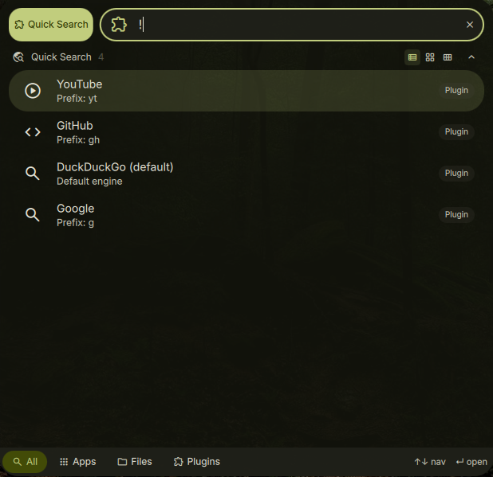

# DankQuickSearch

A minimal launcher plugin for [DankMaterialShell](https://github.com/AvengeMedia/DankMaterialShell) that adds quick web search with engine prefixes.



## Features

- Search DuckDuckGo, Google, GitHub, and YouTube from the launcher
- Engine prefixes for quick switching (`g`, `gh`, `yt`)
- Direct URL detection - type a URL to open it
- Configurable default search engine

## Installation

### Nix (flake)

Add as a `flake = false` input and include in your DMS plugin configuration:

```nix
inputs.dms-plugin-quicksearch = {
  url = "github:alcxyz/DankQuickSearch";
  flake = false;
};
```

```nix
programs.dank-material-shell.plugins.dankQuickSearch = {
  enable = true;
  src = inputs.dms-plugin-quicksearch;
};
```

### Manual

Copy the plugin directory to `~/.config/DankMaterialShell/plugins/DankQuickSearch/`.

## Usage

Activate with `!` (default trigger) in the DMS launcher, then:

- `!hello world` - search DuckDuckGo for "hello world"
- `!g hello world` - search Google
- `!gh nix flake` - search GitHub
- `!yt music video` - search YouTube
- `!github.com` - open URL directly

## Requirements

- `xdg-open` (for opening URLs in the default browser)

## License

MIT

<details>
<summary>Support</summary>

- **BTC:** `bc1pzdt3rjhnme90ev577n0cnxvlwvclf4ys84t2kfeu9rd3rqpaaafsgmxrfa`
- **ETH / ERC-20:** `0x2122c7817381B74762318b506c19600fF8B8372c`
</details>
